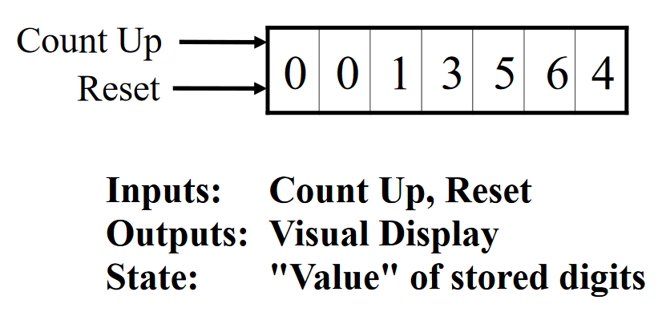
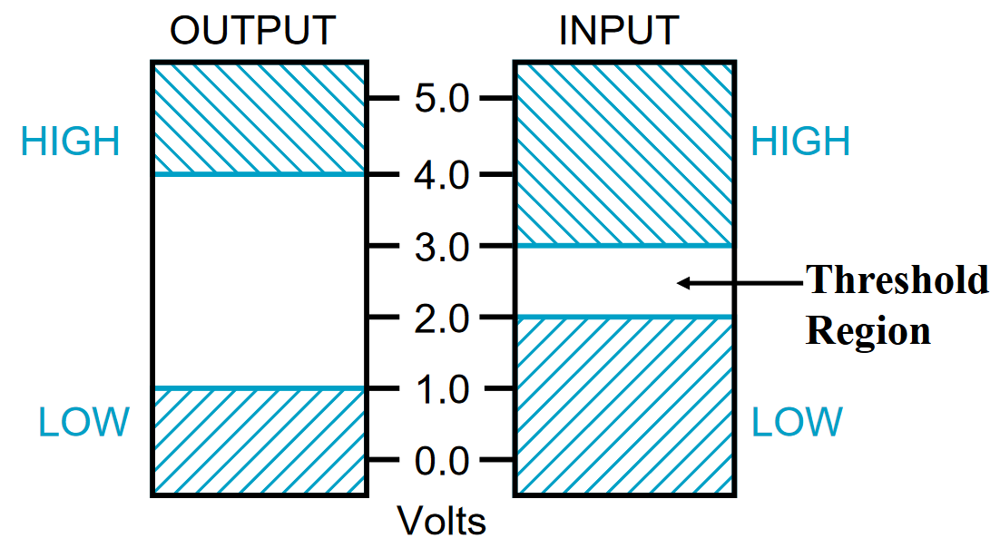
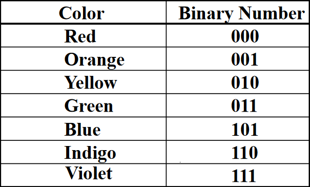
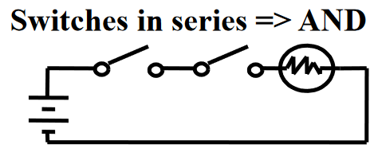
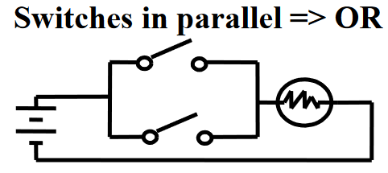
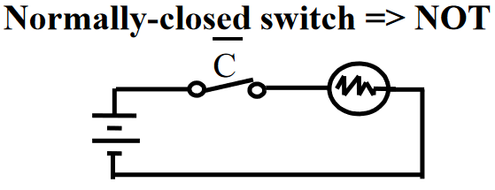
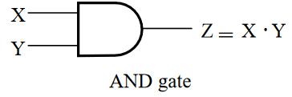
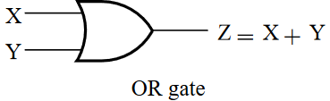
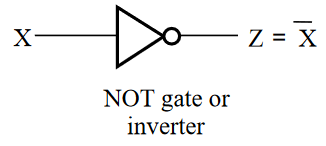

$\pagebreak$

## Course Information

Course Title: CS-370 - Computer Architecture

Professor: Tao Xie ([txie@sdsu.edu](mailto:txie@sdsu.edu))

Office Hours: Friday 1100-1200 or by Zoom appointment.

Textbook: Logic and Computer Fundamentals, 5th ed., Mano/Kime/Martin.

Grading Breakdown:

* 20% Homework
* 25% Lab
* 25% Midterm
* 30% Final
* 0% Weekly Exercises

$\pagebreak$

## Chapter 1 - Digital Computers and Information

### Digital Systems and Computer Systems

Digital systems take a set of discrete information **inputs** and discrete internal information (**system state**) and generates a set of discrete information **outputs** (i.e. the odometer on a car's dashboard).

{width=350px}

Side Note: It is critical to use a cache with a CPU. Memory access is *slow*.

### Signal

An information variable represented by physical quantity is a signal (e.g. voltages and circuits). For digital systems, the variable takes on discrete values. Two level (binary) values are the most prevalent in digital systems.

Abstractly, they can be represented by:

* 0 and 1
* False (F) and True (T)
* Low (L) and High (H)
* On and Off

There are two types of digital signals: asynchronous and synchronous.

**Asynchronous** is discrete in value and continuous in time - it is able to change at any time.

**Synchronous** is discrete in value and time - it is consistent (**sync**hronous!) with the clock on the computer.

**Threshold regions** are important because they define the intermediate area to differentiate high and low value (binary). Output needs to have a larger threshold region than input because signal *always* has more noise than it came with (think operations done on the signal while in the CPU, etc).

{width=350px}

This is why binary representations are so useful; they avoid the complexities that come with designing a circuit which takes more than 2 extremes. Binary makes transistors cheap, easily designed, and reliable.

### Abstraction Layers in Computer Systems Design

Layers of abstraction are the different layers of "visibility" that one has of an underlying implementation. For example, a programming language is an abstraction for physically turning transistors on and off and therefore a higher layer of abstraction. Designing digital circuits is based upon the following steps:

1. Specification
2. Formulation
3. Optimization
4. Technology Mapping
5. Verification

### Number Systems

#### Special Powers of 2

* $2^{10}$ (1024) is Kilo, denoted "K"
* $2^{20}$ (1,048,576) is Mega, denoted "M"
* $2^{30}$ (1,073,741,824) is Giga, denoted "G"

Example:

1-4. What is the exact number of bits in a memory that contains (a) 128K bits; (b) 32M bits; (c) 8G bits?

(a):
\begin{align*}
  128\text{K bits} &= 128 \cdot 1024 \text{ bits}\\
  &= 1,048,576 \text{ bytes}\\
  1,048,576 \text{ bytes} &= 1,048,576 \cdot 8 \text{ bits} \\
  &= 1,048,576 \text{ bits}
\end{align*}

(b):
\begin{align*}
  32\text{M bits} &= 32 \cdot 1,048,576 \text{ bits}\\
  &= 33,554,432 \text{ bytes}\\
  33,554,432 \text{ bytes} &= 33,554,432 \cdot 8 \text{ bits}\\
  &= 268,435,456 \text{ bits}
\end{align*}

(c):
\begin{align*}
  8\text{G bits} &= 8 \cdot 1,073,741,824 \text{ bits}\\
  &= 8,589,934,592 \text{ bytes}\\
  8,589,934,592 \text{ bytes} &= 8,589,934,592 \cdot 8 \text{ bits}\\
  &= 68,719,476,736 \text{ bits}
\end{align*}

#### Base Conversions

| Decimal ($\text{N}_{10}$) | Binary ($\text{N}_2$)  | Hexadecimal ($\text{N}_{16}$) |
|:-------------------------:|:----------------------:|:-----------------------------:|
|             0             |          0000          |               0               |
|             1             |          0001          |               1               |
|             2             |          0010          |               2               |
|             3             |          0011          |               3               |
|             4             |          0100          |               4               |
|             5             |          0101          |               5               |
|             6             |          0110          |               6               |
|             7             |          0111          |               7               |
|             8             |          1000          |               8               |
|             9             |          1001          |               9               |
|             10            |          1010          |               A               |
|             11            |          1011          |               B               |
|             12            |          1100          |               C               |
|             13            |          1101          |               D               |
|             14            |          1110          |               E               |
|             15            |          1111          |               F               |

Converting decimals to a fractional binary part (like 0.6875 to binary):

* Multiply by 2.
* Take the integer value and place it on the right hand of the equal sign.
  * Subtract 1 if the integer is 1.
* Repeat until remainder is 0.
* Read off in forward direction.

If the binary part does not terminate (like $0.65_{10}$ to $\text{N}_2$), specify the number of bits to the right of radix point and round or truncate the number.

### Binary Numbers and Binary Coding

There are two types of information:

* Numeric
  * Must represent range of data needed
  * Ideal because computation is straightforward, uses common arithmetic.
  * Tight relation to binary numbers

* Non-numeric
  * More flexible, no arithmetic operations
  * Not tied to binary numbers

Following certain constraints, any binary combination (code word) can be assigned to any data as long as data is uniquely encoded. Given $n$ binary digits (bits), a binary code is a mapping from a set of represented elements to a subset of the $2^n$ binary numbers.

{width=350px}

In order to determine the minimum number of bits $n$ needed to represent $M$ elements:

$2^n \geq M > 2^{(n-1)}$; $n = \lceil \log_2 M \rceil$

**Binary Coded Decimal (BCD)** is the simplest, most intuitive binary code for decimal digits. It is the binary representation of decimal numbers but only for decimal values 0-9.

Conversion is **NOT** the same as coding. For example, $13_{10} = 1101$ is conversion and $13 \longleftrightarrow 0001 | 0011$ is coding.

#### Gray Codes

Gray Codes are special ways of representing binary digits in order to "flip" less bits when rolling over values.

| Binary Code | Bit Changes | Gray Code | Bit Changes |
|:-----------:|:-----------:|:---------:|:-----------:|
|     000     |             |    000    |             |
|     001     |      1      |    001    |      1      |
|     010     |      2      |    011    |      1      |
|     011     |      1      |    010    |      1      |
|     100     |      3      |    110    |      1      |
|     101     |      1      |    111    |      1      |
|     110     |      2      |    101    |      1      |
|     111     |      1      |    100    |      1      |
|     000     |      3      |    000    |      1      |

A code is a *Gray* code if only one bit changes at a time during counting.

$\pagebreak$

## Chapter 2 - Combinational Logic Circuits

### Gate Circuits and Boolean Equations

**Binary variables** take on one of two values.

**Logical operators** operate on binary values and binary values. The basic logical operators are the logic functions AND, OR, and NOT. **Logic gates** implement these logic functions.

#### Logical Operations

As previously stated, we have:

* AND ($\cdot$)
* OR ($+$)
* NOT (overbar, ~, or ')

Ex:

$Y = A \cdot B$ - "Y is equal to A AND B"

$z = x + y$ - "z is equal to x OR y"

$X = \bar{A}$ - "X is equal to NOT A"

**Truth Table** - a tabular listing of the values of a function for all possible combinations of values on its arguments.

| x | y | AND | OR | NOT(X) |
|:-:|:-:|:---:|:--:|:------:|
| 0 | 0 |  0  |  0 |    1   |
| 0 | 1 |  0  |  1 |    1   |
| 1 | 0 |  0  |  1 |    0   |
| 1 | 1 |  1  |  1 |    0   |

#### Logic Function Implementation

For inputs, logic 1 is switch _closed_, logic 0 is switch _opened_.

For outputs, logic 1 is light on, logic 0 is light off.

{width=350px}

{width=350px}

{width=350px}

#### Logic Gates

**Logic Gates** are implemented physically with transistors.

{width=350px}

{width=350px}

{width=350px}

Boolean equations, truth tables, and logic diagrams describe the same function! Truth tables are unique; expressions and logic diagrams are not. This gives flexibility in implementing functions.

**Boolean Algebra** is a mathematical system for specifying and transforming logic functions. It is an algebraic structure defined on a set of at least two elements, together with three binary operators ($+$, $\cdot$, overbar) that satisfies the following identities:

1. $X + 0 = X$
2. $X \cdot 1 = X$
3. $X + 1 = 1$
4. $X \cdot 0 = 0$
5. $X + X = X$
6. $X \cdot X = X$
7. $X + \bar{X} = 1$
8. $X \cdot \bar{X} = 0$
9. $\bar{\bar{X}} = X$
10. $X + Y = Y + X$ - Commutative
11. $XY = YX$ - Commutative
12. $(X + Y) + Z = X + (Y + Z)$ - Associative
13. $(XY)Z = (XY)Z = X(YZ)$ - Associative
14. $X(Y+Z) = XY + XZ$ - Distributive
15. $X + YZ = (X+Y)(X+Z)$ - Distributive
16. $\bar{X+Y} = \bar{X} \cdot \bar{Y}$ - De Morgan's Law
17. $\bar{X\cdot Y} = \bar{X} + \bar{Y}$

If the meaning is unambiguous, we leave out the $\cdot$.

The **dual** of an algebraic expression is obtained by interchanging $+$ and $\cdot$ and interchanging 0's and 1's. The prior identities appear in dual pairs. When there is only one identity (with no pair), it is self-dual (dual expression is original expression).

Boolean operators have a precedence (order of evaluation) as follows:

1. Parentheses
2. NOT
3. AND
4. OR

### Canonical Forms (Lecture 3) incomplete

### Circuit Optimization

The goal of circuit optimization is to obtain the simplest implementation for a given function. Optimization is a more formal approach to simplification that is performed using a specific procedure or algorithm. We measure *cost criterion* to measure the simplicity of a circuit:

* Literal cost (L)
* Gate input cost (G)
* Gate input cost with NOTs (GN)

*Note: Both gate input costs are considered one.*

#### Literal Cost

Literal - a variable or its complement.

Literal cost - the number of literal *appearances* in a Boolean expression corresponding to the logic circuit diagram.

Example:

$F = BD + A\bar{B}C + A\bar{C}\bar{D};L = 8$

> This is best since it has the lowest literal cost.

$F = BD + A\bar{B}C + A\bar{B}\bar{D} + AB\bar{C};L = 11$

$F = (A+B)(A+D)(B+C+\bar{D})(\bar{B}+\bar{C}+D);L = 10$

#### Gate Input Cost

Gate inputs costs are the number of inputs to the gates in the implementation corresponding exactly to the given equation or the given equations. (G - inverters not counted, GN - inverters counted)

For SOP equations, it can be found from the equation(s) by finding the sum of:

* all literal appearances (L)
* the number of terms excluding terms consisting only of a single literal (G)
* optionally, the number of **distinct** complemented single literals (GN)

More simply:

$G = L + \text{\# of terms}$

$GN = G + \text{\# of distinct not gates}$.

Example:

$F = BD + A\bar{B}C + A\bar{C}\bar{D};G = 11, GN = 14$

> This remains the best since it has the lowest gate input cost.

$F = BD + A\bar{B}C + A\bar{B}\bar{D} + AB\bar{C};G = 15, GN = 18$

$F = (A+B)(A+D)(B+C+\bar{D})(\bar{B}+\bar{C}+D);G = 14, GN = 17$

#### Boolean Function Optimization (Karnaugh Maps)

Minimizing the gate input (or literal) cost of a (set of) Boolean equation(s) reduces circuit cost. Boolean Algebra and graphical techniques are tools to minimize cost criteria values, or more specifically, the Karnaugh Map (K-map).

A K-map is a collection of squares:

* each square represents a *minterm*
* the collection of squares is a graphical representation of a Boolean function
* adjacent squares differ in the value of one variable
* alternative algebraic expressions for the same function are derived by recognizing patterns of squares

Add something about gray codes and more K-maps lol

#### Systematic Simplification

A *Prime Implicant* is a product term (AND term e.g. $A \cdot B \cdot C$) obtained by combining the **maximum possible** number of adjacent squares in the map into a rectangle with the number of squares **a power of 2**. It is called an *essential prime implicant* if it is the **only** prime implicant that covers (includes) **one or more** minterms.

Using the prime implicant, we can optimize the solution:

1. Find all prime implicants
2. Include all essential prime implicants in the solution
3. Select a minimum cost set of non-essential prime implicants to cover all minterms not yet covered
  * A good simplified solution: Use the Selection Rule

##### Selection Rule

Minimize the overlap among prime implicants as much as possible. In particular, in the final solution, make sure that each prime implicant selected includes at least one minterm not included in any other prime implicant selected.

### Circuit Optimization

#### Buffers

A buffer is a gate with the function $F=X$. In terms of Boolean function, a buffer is the same as a connection. We use these as an electronic "amplifier" to improve circuit voltage levels and increase the speed of circuit operation.

#### NAND Gate

NAND (NOT AND) gates can be used to get every other gate. The NAND operation is not associative.

## Chapter 3 - Combinational Logic Design

### Implementation Technology and Logic Design

A combinational logic circuit has:

* A set of $m$ Boolean inputs
* A set of $n$ Boolean outputs
* $n$ switching functions, each mapping the $2^m$ input combinations to an output such that the current output depends only on the current input values

#### Hierarchical Design

To control the complexity of the function mapping inputs to outputs:

1. Decompose the function into smaller pieces called *blocks*.
2. Decompose each block's function into smaller blocks, repeating as necessary until all blocks are small enough
3. Any block not decomposed is called a *primitive block*.

The collection of all blocks including the decomposed ones is a *hierarchy*.
