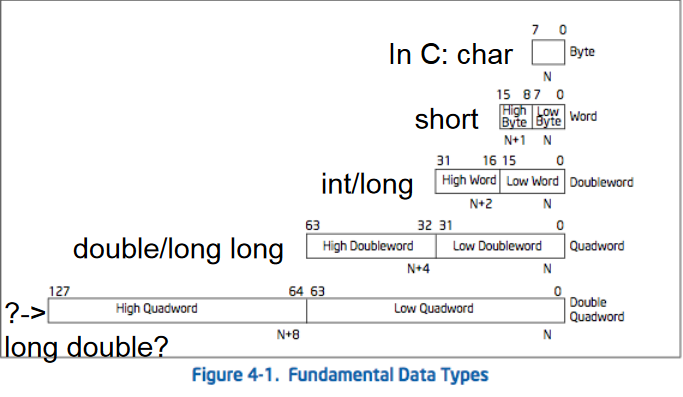
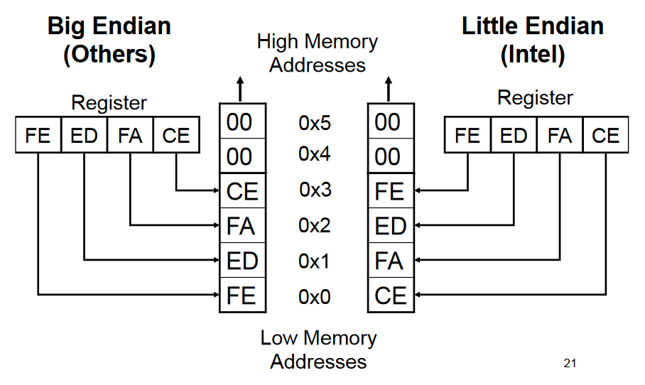
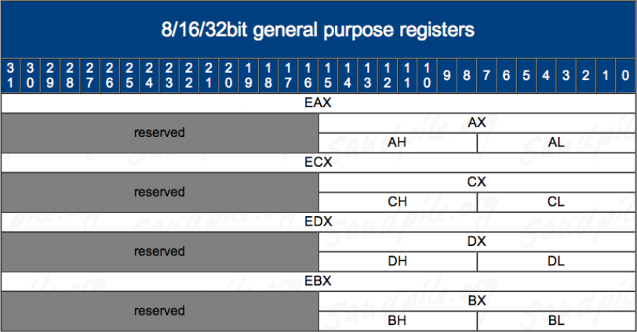
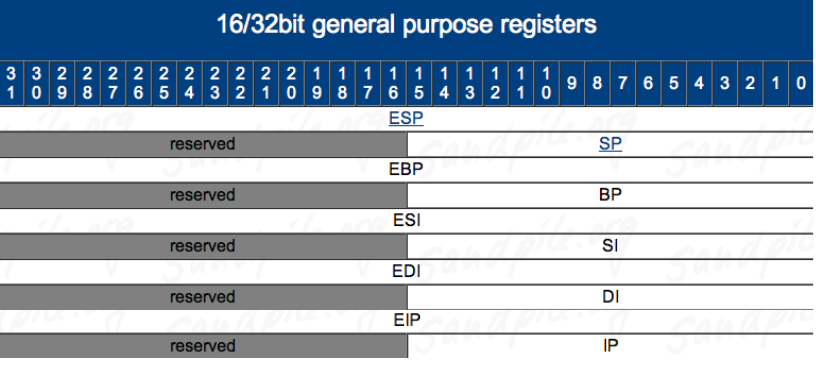

# Intel x86 Assembly

## Refresher

### Data Types

### Basic decimal/binary/hex conversions

| Decimal | Binary | Hexadecimal |
|---------|--------|-------------|
| 00      | 0000b  | 0x00        |
| 01      | 0001b  | 0x01        |
| 02      | 0010b  | 0x02        |
| 03      | 0011b  | 0x03        |
| 04      | 0100b  | 0x04        |
| 05      | 0101b  | 0x05        |
| 06      | 0110b  | 0x06        |
| 07      | 0111b  | 0x07        |
| 08      | 1000b  | 0x08        |
| 09      | 1001b  | 0x09        |
| 10      | 1010b  | 0x0A        |
| 11      | 1011b  | 0x0B        |
| 12      | 1100b  | 0x0C        |
| 13      | 1101b  | 0x0D        |
| 14      | 1110b  | 0x0E        |
| 15      | 1111b  | 0x0F        |

### Negative numbers in binary

**One's complement** - flip all bits

**Two's complement** - one's complement + 1

Negative numbers are two's complement of positive numbers.

## Architecture

Intel x86 is a Complex Instruction Set Computer (CISC). It contains a lot of
different special purpose instructions, many which are not commonly used.
Instructions are typically between 1 and 16 bytes.

Other common architectures include Reduced Instruction Set Computers (RISC).
These typically include more registers and less/fixed-size instructions.

### Endianness

**Little Endian** - 0x12345678 stored in RAM "little end" first. The least significant byte of a word or larger is stored in the lowest address. Intel is little endian.

**Big Endian** - 0x12345678 is stored as is. Network traffic is big endian and most everything else is big endian.

### Registers

**Registers** are small memory storage areas built into the processor (volatile memory).

There are 8 general purpose registers and an instruction pointer which point to the next instruction to execute.

On x86-32, registers are 32 bits long.

On x86-64, registers are 64 bits long.

#### Register Conventions

Intel's suggestions for register usage.

* EAX - Stores function return values
* EBX - Base pointer to the data section
* ECX - Counter for string and loop operations
* EDX - I/O pointer
* ESI - Source pointer for string operations (E**S**I**, source)
* EDI - Destination pointer for string operations (E**D**I, destination)
* ESP - Stack pointer
* EBP - Stack frame base pointer
* EIP - Pointer to next instruction to execute ("instruction pointer")

Caller-save registers - eax, edx, ecx

* If the caller has anything important in one of the registers above, the caller is in charge of saving the value before calling the subroutine and then restoring it.
* The callee can (and is highly likely to) modify values in caller-save registers.

Callee-save registers - ebp, ebx, esi, edi

* If the callee needs to use more registers than are saved by the caller, the callee is responsible for storing/restoring values.

When Intel transitioned from 16 to 32-bit, the general purpose registers grew in size. Similarly, those previously named addresses can still be accessed. In the photo below, we can access AX as a specific part of EAX In the photo below, we can access AX as a specific part of EAX.

### EFLAGS

**EFLAGS** register holds many single bit flags. Only two will be focused on now.

* Zero Flag (ZF) - Set if the result of some instruction is zero; cleared otherwise.

* Sign Flag (SF) - Set equal to the most-significant bit of the result, which is the sign bit of a signed integer. (0 indicates a positive value and 1 indicates a negative value.)

**NOP** - No Operation! This is only used to pad/align bytes, or to delay time. This is implemented as an `XCHG (E)AX, (E)AX` instruction.

### The Stack

The stack is a conceptual area of main memory (RAM) which is designated by the OS when a program is started. It is Last-In-First-Out (LIFO). Data is "pushed" onto the top of the stack and "popped" off the top.

By convention, the stack grows toward lower memory addresses. Adding something to the stack means the top of the stack is now at a lower memory address.

esp points to the top of the stack, the lowest address being used. The stack keeps track of which functions were called before the current one, holds local variables, and is frequently used to pass arguments to the next function to be called.

**PUSH** - Push Word, Doubleword, or Quadword onto the Stack. This can either be an immediate (numeric constant), or the value in a register. We'll be using DWORD.

The push instruction automatically decrements the stack pointer, esp, by 4.

**POP** - Pop a Value from the stack. Take a DWORD off the stack, put it in a register, and increment esp by 4.
